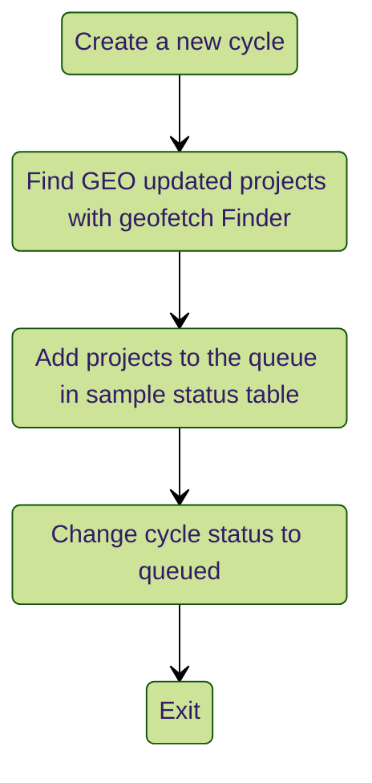
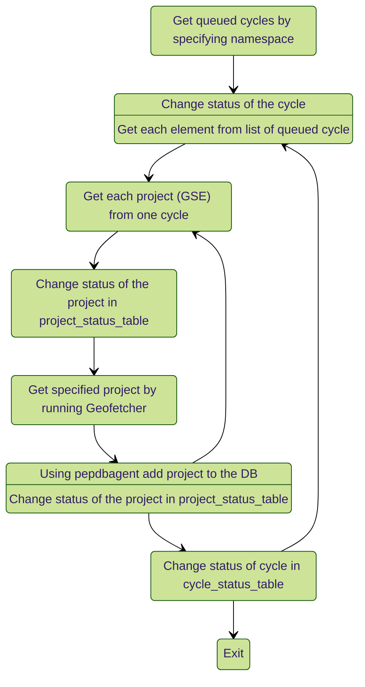
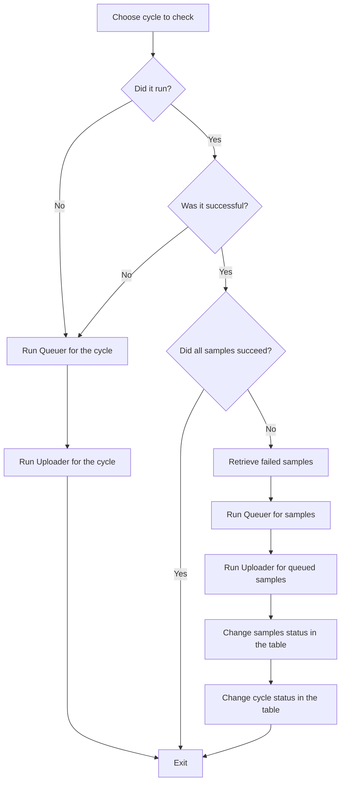

# metageo_pephub
Automatic Uploader for GEO metadata projects to [PEPhub](https://pephub.databio.org/).

# Overview:
The Metageo_pephub uploader consists of 3 main functionalities:

1) Queuer: A set of functions that searches for new projects in GEO, creates a new cycle for the current run, and records information for each GEO project by setting its status to "queued" and adding it to the database.
2) Uploader: Checks if there are any queued cycles in the Cycle_status table. Gets a list of queued projects, runs Geofetch for them, and uploads the results to Pephubdb using Pepdbagent. Metageo_pephub updates the project uploading status at every step so that it can be checked later to determine why the upload failed and what happened.
3) Checker: Responsible for checking previous cycles, their status, and if they were run. If a cycle was not run or was unsuccessful, it will rerun it. If only one project was unsuccessful, it will try to upload it again.

More information about these processes can be found in the flowcharts and overview below.

## Queuer Flowchart:

## Uploader Flowchart:

## Checker Flowchart:

